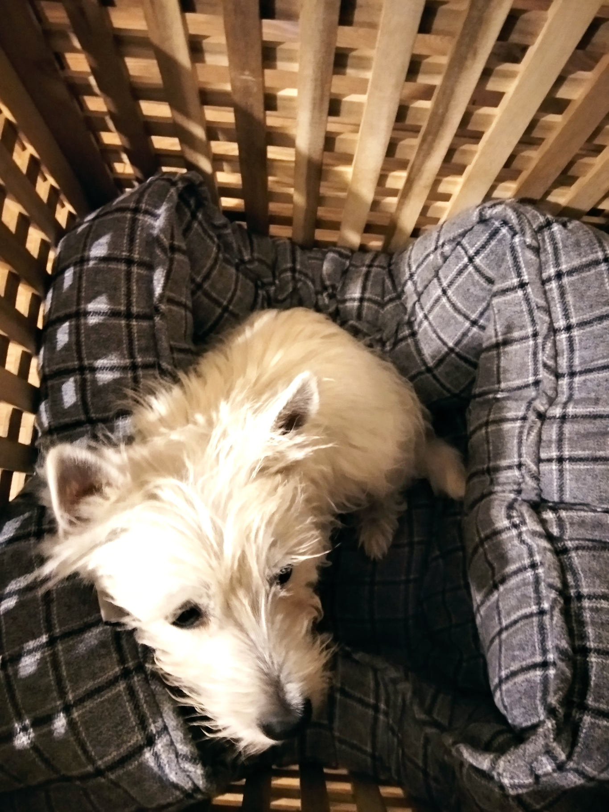

We discovered this photo when we are building this website, and shocked that how weak and thin Mountain was when he came to us two years ago. We put him in a cage, trying what our neighbour told us. However, he does not like it, trying to ecsape, and weaping all night in the cage. So eventually we gave up, and since then to now, he is sleeping with us on the bed togather.

