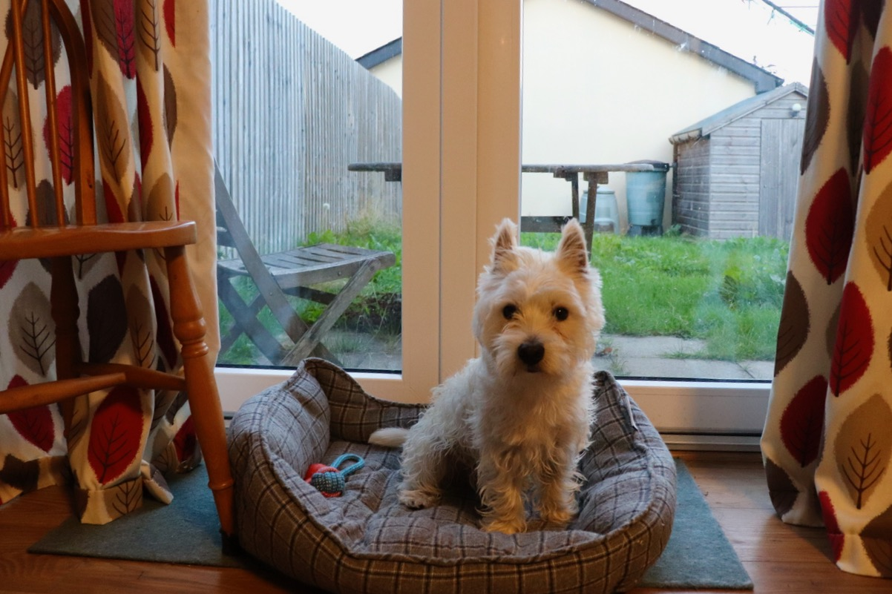

We get new neighbour, who have two cats. And the two cats sometimes come to our yard, which drive Mountain crazy. Some say this dog (West Highland Terrier) have hunting nature in their DNA, but maybe he just want to say hi and play with those cats. However, he never get chance to have a close conversation with those cats.

